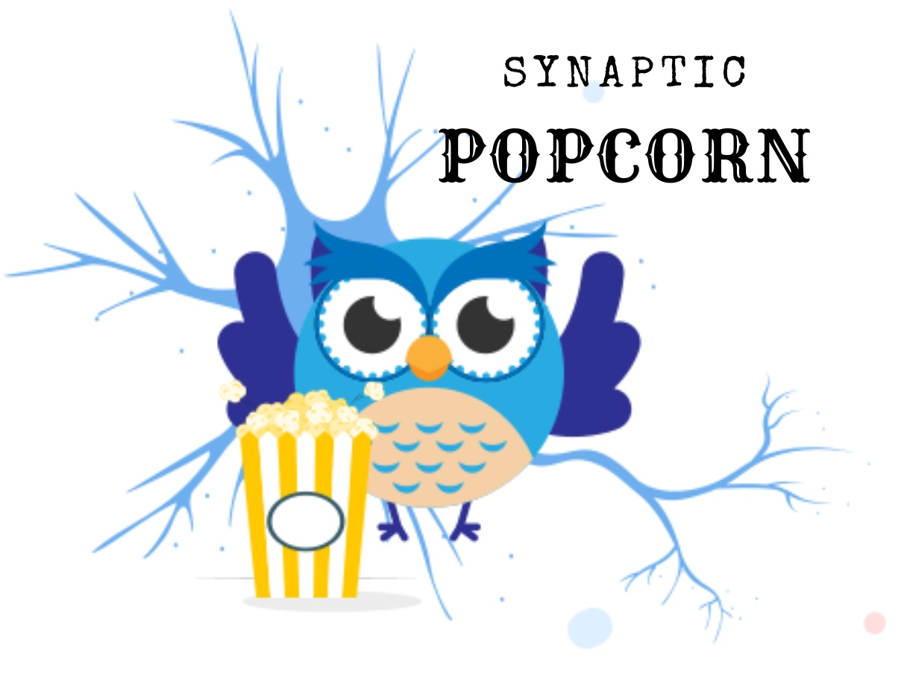

<h4> We had a fun semester with the Synaptic Popcorn Cinema at Jupiter FAU in 2023. We hope to return during next Fall 2024. 
If you like cinema and science, feel free to reach out with ideas. See below our previous edition of the cinema. </h4>

# Art & Culture
<html>
<body>

We believe that science is fun! Come to watch a movie and learn about neuroscience and artificial intelligence at
the Synaptic Popcorn Cinema at Jupiter FAU. 

We make the effort to provide movies where you will have the opportunity to learn beyond the classroom or the lab. 
After each film, we encourage you to share your thoughts and questions with fellow enthusiasts. 

<b>Admission is Free!</b>
<b>Location:</b> FAU Jupiter, AD 119, 5 p.m.

You are highly encouraged to read the material associated with the movies so we can discuss connections.

<h1>Upcoming Movie Dates</h1>
<table border="1">
<tr>
<th>Movie</th>
<th>Genre</th>
<th>Date</th>
<th>Time</th>
<th>Running time</th>
<th>Reading material</th>
<th>Registration link</th>
</tr>
<tr>
<td>Memento (2000)</td>
<td>Mystery & Thriller</td>
<td>October 4, 2023</td>
<td>5 PM</td>
<td>113 min</td>  
<td><a href="https://www.ncbi.nlm.nih.gov/pmc/articles/PMC2649674/"> Link</a></td>
<td><a href="https://forms.office.com/r/MaV5TWa6Bh"> Register!</a></td>
</tr>
<tr>
<td>Alice Cares (2015)</td>
<td>Documentary</td>
<td>October 19 *Thursday, 2023</td>
<td>5 pm</td>
<td>80 min</td>    
<td><a href="https://www.frontiersin.org/articles/10.3389/fpubh.2023.1166120/full"> Link</a></td>
<td><a href="https://forms.office.com/r/aC8Yxxv5RH"> Register!</a></td>
</tr>
<tr>
<td>The brain that wouldn't die (1962)</td>
<td>Science Fiction & Horror</td>
<td>November 1, 2023</td>
<td>5 PM</td>
<td>71 min</td>  
<td><a href="https://www.ncbi.nlm.nih.gov/pmc/articles/PMC9805622/"> Link</a></td>
<td><a href="https://forms.office.com/r/62rdUvBXee"> Register!</a></td>
</tr>
<tr>
<td>You go to my head (2017)</td>
<td>Romantic Thriller</td>
<td>November 15, 2023</td>
<td>5 PM</td>
<td>116 min</td>  
<td><a href="https://www.ncbi.nlm.nih.gov/pmc/articles/PMC3182004/"> Link</a></td>
<td><a href="https://forms.office.com/r/nniGmDKQ1P"> Register!</a></td>
</tr>
<tr>
<td>Das Kabinett des Doktor Caligari ( The Cabinet of Dr. Caligari ) (1919)</td>
<td>Silent Horror & Fantasy</td>
<td>November 29, 2023</td>
<td>5 PM</td>
<td>51 min</td>  
<td><a href="https://ajp.psychiatryonline.org/doi/full/10.1176/appi.ajp.161.7.1149"> Link</a></td>
<td><a href="https://forms.office.com/r/p5YvFqAVE9"> Register!</a></td>
</tr>
</table>

Selected movies have Public Performance Licensing according to the <a href="https://libguides.fau.edu/copyright-for-teaching/streaming-video-copyright"> FAU library</a>.

</body>
</html>

