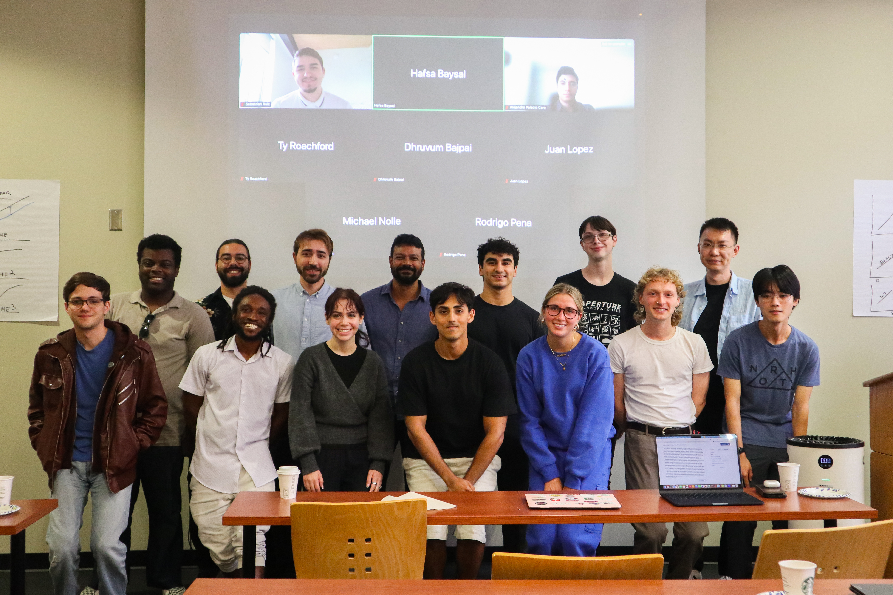
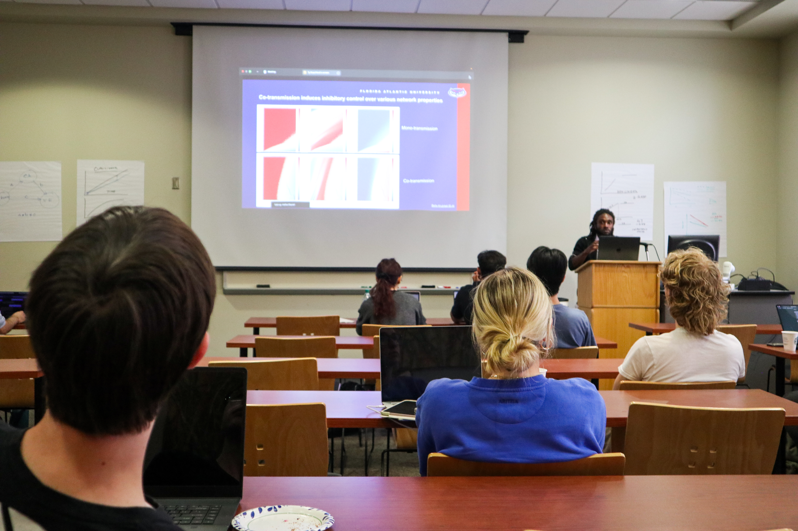

# Workshops

<section class="workshop-hero-panel" aria-labelledby="scan-title">

  

    

      Featured upcoming workshop
    

    <h2 id="scan-title">
      School for Computational Applications in Neuroscience 2026
    </h2>

    

      SCAN 2026
    

    

      A focused training event by the Pena Lab at Florida Atlantic University,
      bringing together computational neuroscience, connectomics, protein
      structure, artificial intelligence, bioinformatics, simulation,
      quantum computing, and emerging computational methods for neuroscience research.
    

    

      

      

    

  

  <article>
    <h3>About SCAN</h3>

    

      The School for Computational Applications in Neuroscience is designed
      as an immersive short school for students and researchers interested
      in modern computational approaches to neuroscience. The program highlights
      practical methods, active research directions, and community-building
      around computational neuroscience at FAU.
    

  </article>

  <article>
    <h3>Workshop series</h3>

    

      This page will grow into a home for Pena Lab workshops offered locally
      and around the world. SCAN is the first featured event in a broader effort
      to share computational neuroscience tools, training, and scientific exchange
      with diverse research communities.
    

  </article>

  <h2>Accepted Participants</h2>

  

    <table class="participants-table">
      <thead>
        <tr>
          <th>Name</th>
          <th>Institution</th>
        </tr>
      </thead>
      <tbody>
        <tr>
          <td>Ethan Johnson</td>
          <td>Florida International University</td>
        </tr>
        <tr>
          <td>Anika Chowdhury</td>
          <td>Florida International University</td>
        </tr>
        <tr>
          <td>Soleil Escobar</td>
          <td>Florida International University</td>
        </tr>
        <tr>
          <td>Gillian Durta</td>
          <td>Florida State University</td>
        </tr>
        <tr>
          <td>Devyani Jain</td>
          <td>Florida State University</td>
        </tr>
        <tr>
          <td>Victoria Montalvo</td>
          <td>Florida State University</td>
        </tr>
        <tr>
          <td>Max Boyington</td>
          <td>Florida State University</td>
        </tr>
        <tr>
          <td>Zorianna Starks</td>
          <td>Florida State University</td>
        </tr>
        <tr>
          <td>Maisha Milon</td>
          <td>Florida State University</td>
        </tr>
        <tr>
          <td>Daniel Miranda</td>
          <td>Florida State University</td>
        </tr>
        <tr>
          <td>Eva Allen</td>
          <td>Florida State University</td>
        </tr>
        <tr>
          <td>Sofia Sierra</td>
          <td>Florida State University</td>
        </tr>
        <tr>
          <td>Sebastian Ruiz</td>
          <td>Florida State University</td>
        </tr>
        <tr>
          <td>Yabsera Negussie</td>
          <td>Nova Southeastern University</td>
        </tr>
        <tr>
          <td>Wyatt Boyington</td>
          <td>University of Florida</td>
        </tr>
        <tr>
          <td>Mason Martin</td>
          <td>Florida Atlantic University</td>
        </tr>
        <tr>
          <td>Rebecca Goodman</td>
          <td>Florida Atlantic University</td>
        </tr>
        <tr>
          <td>Tasianna Giordano</td>
          <td>Florida Atlantic University</td>
        </tr>
        <tr>
          <td>Sweetha Manikandan</td>
          <td>Florida Atlantic University</td>
        </tr>
      </tbody>
    </table>
  

  <h2>SCAN Program Schedule</h2>

  

    <article class="schedule-day schedule-day-arrival">
      

        Wednesday, May 13
        <strong>Arrival and check-in</strong>
      

      <ol class="timeline">
        <li>
          <time>6:00 pm</time>
          

            <strong>Arrival &amp; Check-in</strong>
            Homewood Suites by Hilton Palm Beach Gardens
            
              <a
                class="workshop-map-link"
                href="https://www.google.com/maps/search/?api=1&query=4700+Donald+Ross+Rd%2C+Palm+Beach+Gardens%2C+FL+33418"
                target="_blank"
                rel="noopener noreferrer"
                aria-label="Open directions to Homewood Suites by Hilton Palm Beach Gardens in Google Maps"
              >
                4700 Donald Ross Rd, Palm Beach Gardens, FL 33418
              </a>
            
          

        </li>
      </ol>
    </article>

    <article class="schedule-day">
      

        Thursday, May 14
        <strong>Workshop start and computational neuroscience methods</strong>
      

      <ol class="timeline">
        <li>
          <time>9:00 am</time>
          

            <strong>Opening Remarks and Workshop Start</strong>
            Dr. Rodrigo Pena, Introduction to SCAN
          

        </li>
        <li>
          <time>10:00 am</time>
          

            <strong>Dr. Yue Liu</strong>
            Recurrent Neural Networks
          

        </li>
        <li>
          <time>11:00 am</time>
          

            <strong>Dr. Cristina Ferrer</strong>
            Protein Structures
          

        </li>
        <li class="timeline-break">
          <time>12:00 pm</time>
          

            <strong>Lunch Break</strong>
          

        </li>
        <li>
          <time>1:30 pm</time>
          

            <strong>Dr. Juan Lopez</strong>
            Methods for Connectomic Dataset Access
          

        </li>
        <li>
          <time>2:30 pm</time>
          

            <strong>Dr. Cesar Ceballos</strong>
            Connectomic Data Analysis
          

        </li>
        <li>
          <time>3:30 pm</time>
          

            <strong>Ty Roachford</strong>
            Large-scale Connectomic Simulations
          

        </li>
        <li>
          <time>4:30 pm</time>
          

            <strong>Lindsey Knowles</strong>
            Quantum Computing Introduction and Applications
          

        </li>
        <li class="timeline-break">
          <time>6:30 pm</time>
          

            <strong>Dinner @ <em>TBD</em></strong>
          

        </li>
      </ol>
    </article>

    <article class="schedule-day">
      

        Friday, May 15
        <strong>AI, bioinformatics, conclusion, and NeuroCollective</strong>
      

      <ol class="timeline">
        <li>
          <time>9:00 am</time>
          

            <strong>Dhruvum Bajpai</strong>
            AI methods for Data Analysis
          

        </li>
        <li>
          <time>10:00 am</time>
          

            <strong>Belle Krubitski</strong>
            Bioinformatics: Applications
          

        </li>
        <li class="timeline-break">
          <time>11:00 am</time>
          

            <strong>Workshop Conclusion</strong>
          

        </li>
        <li class="timeline-feature">
          <time>11:30 am</time>
          

            <strong>Lunch &amp; NeuroCollective Start</strong>
            
              SCAN continues into
              <a href="https://www.fau.edu/jupiter/neurocollective/">The NeuroCollective Symposium</a>,
              FAU Jupiter's tri-institute neuroscience event highlighting trainee research,
              networking, and discovery across the local biomedical research community.
            
          

        </li>
      </ol>
    </article>
  

  <h2>Previous Edition: SCAN 2025</h2>

  <section class="scan-previous-edition">
    <article class="scan-2025-info">
      <h3>Summer 2025 - First Edition</h3>
      

        The first edition of the Summer School for Computational Applications in Neuroscience (SCAN) 
        was held in summer 2025 at Florida State University. The course was invited by the CompNeuroSociety 
        and served as a foundational event for establishing this innovative training program in computational 
        neuroscience, bringing together students and researchers from many institutions to learn modern 
        computational approaches.
      

    </article>

    

      <figure>
        
        <figcaption>SCAN 2025 at Florida State University</figcaption>
      </figure>
      <figure>
        
        <figcaption>SCAN 2025 Workshop in Progress</figcaption>
      </figure>
    

  </section>

